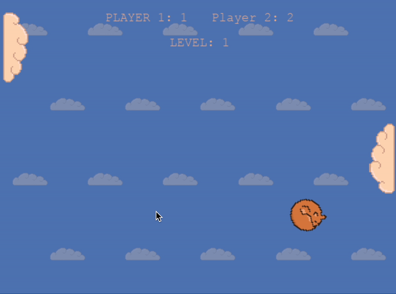

# 👩🏻‍💻 Hi there! I'm Aysel!

## 🐾 about me
Fresh graduate of Telerik Academy's Alpha Python Track, where my team project [Kitten Strike API](https://github.com/Alpha63-Match-Score/Match_Score) won 🏆 first place.

I craft 2D games that blend cozy aesthetics with philosophical depth and subtle existential themes.

🚀 Open to junior developer positions where I can contribute my unique blend of creativity and technical skills while continuing to grow in the field.

Check out my [resume](https://github.com/aysieelf/aysieelf/blob/main/AyselKaradayiResume.pdf) for the formal stuff. 📝

## 🐾 latest news
Just finished my [Sleepy Fox](https://github.com/aysieelf/Sleepy-Fox) game! 🦊 The sleepy clouds float gently as they help our tired fox bounce between them in this calm, peaceful version of Pong (until you get to level 8, then it gets crazy!).

What I learned while making this: 
- Designing and creating sprites
- Building a custom physics system with velocity management 
- Creating an AI opponent with adjustable difficulty 
- Implementing a complete sound system with ambient music 

What I used:
- Python with PyGame
- Aseprite for designing the sprites, screens, buttons
- LogicPro for editing the sound fx

## 🐾 what i'm currently working on
- Solving puzzles on [HackerRank](https://github.com/aysieelf/HackerRank-Solutions) and [LeetCode](https://github.com/aysieelf/LeetCode-Solutions)
- Creating games: Check out my [Game Dev Journey](https://github.com/aysieelf/Game-Dev-Journey)
- Learning JavaScript
- Petting cats for inspiration

## 🌈 i craft digital magic using these
**Programming Languages:**

**Frontend:**

**Backend & APIs:**

**Databases:**

**ORMs & Database Tools:**

**Game Development:**

## 🐾 my stats

## 🐾 let's connect

---
*"In a world full of bugs, be the debugger you wish to see! 🐝"*
